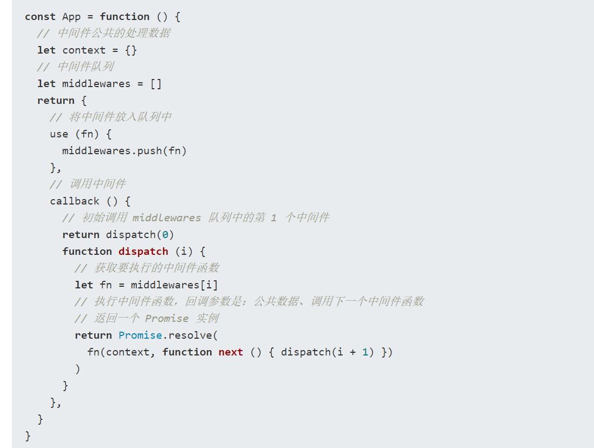

## 一、单页面和多页面应用
单页面：
    解释：一个应用只有一个html主页面, 只加载一次html、css、js等资源, 所有子页面都包含在主页面中, 通过路由去切换页面
    优点：切换页面比较快
多页面：一个应用有多个html页面
    缺点：不同页面之间跳转比较慢

## 二、洋葱模型
一句话：在每个中间件里面调用了下一个中间件函数，除了最后一个
https://segmentfault.com/a/1190000021394840

