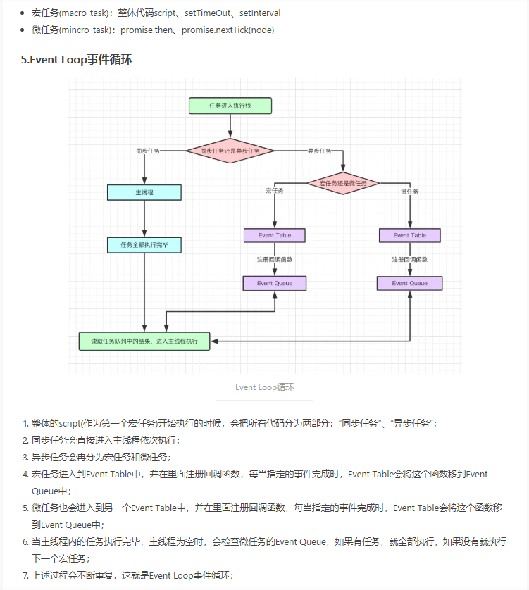
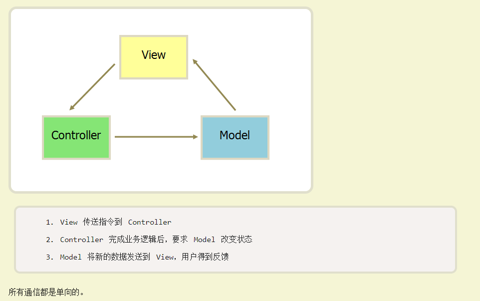
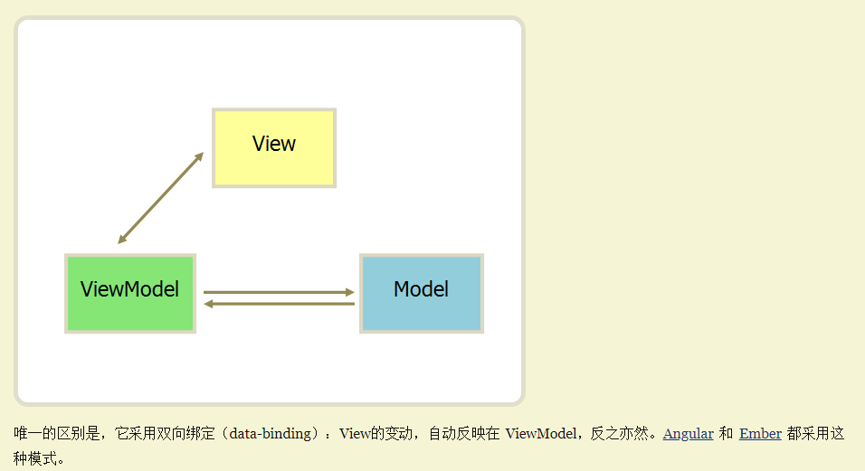

## 一、原生js基础相关
#### 变量区分大小写
#### 1、数据类型有哪些
    基本数据类型(存放在栈中)：string、number、boolean、null、undefined、symbol
    引用类型(存放在堆中)：object、function
**注意1:** 栈和堆的区别
    栈（stack）为自动分配的内存空间, 它由系统自动释放; 而堆（heap）则是动态分配的内存, 大小不定也不会自动释放
**注意2:** null和undefined的区别
    typeof undefined   // undefined
    typeof null        // object
    null === undefined // false
    null == undefined  // true
#### 2、如何判断数据的类型
    typeof 可以正确的判断基本数据类型的类型, 但是对于对象, 都是object, 对于函数都是function
    Object.prototype.toString.call(param) 可以判断基本数据类型和引用数据类型的类型
    ``` bash
        typeof [] === 'object'
        typeof {} === 'object'
        typeof alert === 'function'
        typeof null === 'object' (一个存在很久的bug)
        Object.prototype.toString.call({})  // "[object Object]"
        Object.prototype.toString.call([])  // "[object Array]"
    ```
#### 3、判断是不是某构造函数的实例 
    instanceof：通过原型链判断
    ``` bash
        function Person (name) {
            this.name = name
        }
        let p1 = new Person('张三')
        p1 instanceof Person // true p1是构造函数Person的实例
        Person[Symbol.hasInstance](p1) // true 与上面等价
    ```
#### 4、等号赋值、浅拷贝、深拷贝的区别
https://www.haorooms.com/post/js_copy_sq
等号赋值：新数据和原数据指向同一引用
浅拷贝：新数据和原数据不指向同一个引用, 如果原数据里包含子对象, 新旧子对象共享同一块内存
深拷贝：会另外创造一个一模一样的对象, 新对象跟原对象不共享内存, 修改新对象不会改到原对象
    ``` bash
        #####浅拷贝的实现方式:

        第一种：lodash的方法_.cclone
        第二种：...  注意：必须含有子对象
        第三种：Object.assgin(), 注意：obj里必须含有子对象
        var obj = { a: {msg: "hello", num: 21}, b:3 };
        var cloneObj = Object.assign({}, obj);
        obj === cloneObj; // false
        obj.a.num = 66;
        obj.b = 10;
        console.log(cloneObj.a.num); // 66
        console.log(cloneObj.b); // 3
        第四种：自定义方法
        function shallowClone(initalObj) {    
            var obj = {};    
            for ( var i in initalObj) {
                obj[i] = initalObj[i];
            }    
            return obj;
        }
        var obj = {
            a: "hello",
            b: {
                a: "world",
                b: 21
            },
            c: ["Bob", "Tom", "Jenny"],
            d: function() {
                alert("hello world");
            }
        }
        var cloneObj = shallowClone(obj); 
        cloneObj === obj; // false
        // 新数据和原数据的b、c、d指向同一引用
        cloneObj.b.a = "changed"; // obj和cloneObj都改变
        cloneObj.c[0] = 6; // obj和cloneObj都改变
        cloneObj.d = function() { alert("changed"); } // obj的d属性不改变

        #####深拷贝的实现方式:
        第一种：用JSON.stringify把对象转成字符串，再用JSON.parse把字符串转成新的对象
        第二种：对象只有一层的话可以使用上面的：Object.assign()函数
        第三种：...  注意：不能含有子对象
        第四种：lodash的_.cloneDeep
        第五种：自定义方法，递归拷贝
        //  使用递归的方式实现数组、对象的深拷贝
        function deepClone(obj) {
            //判断拷贝的要进行深拷贝的是数组还是对象，是数组的话进行数组拷贝，对象的话进行对象拷贝
            var objClone = Array.isArray(obj) ? [] : {}
            //进行深拷贝的不能为空，并且是对象或者是
            if (obj && typeof obj === "object") {
                for (let key in obj) {
                    if (obj.hasOwnProperty(key)) {
                        if (obj[key] && typeof obj[key] === "object") {
                            objClone[key] = deepClone1(obj[key])
                        } else {
                            objClone[key] = obj[key]
                        }
                    }
                }
            }
            return objClone;
        }
        deepClone({name: 'yy', age: 12, obj: {color: 'res', big: true}, arr: [1, 2, 3]})
    ```

#### 5、什么是闭包, 闭包的作用, 为什么要使用闭包
    匿名函数本身也是一个闭包
    闭包：函数A里面有一个函数B, 函数B可以访问到函数A里面的局部变量, 函数B就是闭包
    本质：闭包是将函数内部和函数外部连接起来的桥梁
    作用：1、可以读取函数内部的变量 2、让一些变量始终保持在内存中
    为什么要使用闭包：在函数外部无法读取函数内部的局部变量, 如果想要获取, 可以在函数里在声明一个函数
``` bash
// 想要在函数外部获取f1里面的变量n, 所以需要在f1里声明一个f2, 并作为返回值
function f1() {
    var n = 999;
    nAdd = function() {n += 1}; // 没用var声明, 则是全局变量
    function f2(){
        alert(n);
    }
    return f2; // f2就是闭包
}
var result = f1();
result(); // 999
nAdd();
result(); // 1000
```
1、首先函数f1执行后将f2赋给了全局变量result，所以f2始终在内存中，函数f2在函数f1内部，所以在f2的内部可以访问到f1的变量n。
2、因为f2的存在依赖了f1中的变量n，所以使得f1也始终被存储在了内存中，在调用之后，不会被垃圾回收机制回收。（内部函数引用了位于外部函数的变量,当外部函数调用完毕后,这些变量在内存不会被释放,因为闭包需要它们）
#### 6、构造函数和继承
    构造函数作用：需要大批量的创建对象的时候，就需要用到构造函数，它可以方便创建多个对象的实例
    A为父类, 在子类B的构造函数里调用父类的构造函数，拷贝一份父类的原型 作为 子类的原型
    实例化new 的过程中会发生以上四件事情：
        a、新生成了一个对象
        b、链接到原型, 将他的_proto_指向其构造函数的prototype
        c、绑定 this，this指向新对象
        d、返回新对象
#### 7、什么是原型？什么是原型链
    构造函数的prototype属性指向原型,原型的constructor属性指回构造函数,实例的_proto_指向原型。
    所有实例共享原型上的属性和方法
#### 8、浏览器端缓存
    cookie：与服务器端通信,每次都会携带在HTTP头中，保存在客户端浏览器上，不是很安全。cookie的长度和数量受限制,每个domain最多只能有20条cookie,每个cookie长度不能超过4KB。否则会被截掉。
    sessionStorage: 仅在当前会话下有效,关闭页面或浏览器后被清除,存放数据大小为一般为5MB,在客户端中保存,不参与和服务器的通信
    localStorage：存放数据大小为一般为5MB,在客户端中保存,不参与和服务器的通信
    session: 保存在服务器上，比cookie安全，但是当访问增多，会比较占用服务器的性能
#### 9、同步和异步、并发和并行、线程和多线程和单线程、进程
    并行: 同一时刻发生两个或者多个事件。比如：并行：你吃饭吃到一半, 电话来了, 你一边打电话一边吃饭
    并发: 同一时科两个或多个事件在间隔发生。比如：你吃饭吃到一半, 电话来了, 你停了下来接了电话, 接完后继续吃饭

    进程: 当一个程序开始运行时, 它就是一个进程, 一个进程又是由多个线程所组成的
    多线程: 一个程序中可以同时运行多个不同的线程
    单线程: 一个程序中只有一个线程

    进程是资源的分配和调度的一个独立单元，而线程是CPU调度的基本单元
    同一个进程中可以包括多个线程，并且线程共享整个进程的资源（寄存器、堆栈、上下文），一个进程至少包括一个线程
    进程结束后它拥有的所有线程都将销毁，而线程的结束不会影响同个进程中的其他线程的结束
    多线程的目的是提高cpu利用率

    同步：A请求回来了再发B请求
    异步：A请求和B请求可以同时发
#### 10、for循环有哪些方法及区别
``` bash
    let arr = [2,4,1,5,7]
    arr.length= 5
    let obj = {name: '张三', age: 12}
    let str = 'abcdefg123'
    // 支持数组、字符串
    for (let i=0;i<=str.length-1;i++) {
        console.log(i, arr[i]) // i是索引
    }
    //  支持数组、字符串、对象
    // 缺点(针对数组)：可以将属性打印出来
    for (let i in arr) {
        console.log(i, arr[i]) // i是索引0,1,2,3,4,length
    }
    //  支持数组、字符串(es6提出,解决for-in的缺陷, 只返回具有数字索引的属性)
    for (let value of arr) {
        console.log(value) // value 是值, 不是索引
    }
```
#### 11、箭头函数和普通函数的this指向
    箭头函数：如果包裹在函数中, 只取决包裹箭头函数的第一个普通函数的this
    普通函数：this由函数调用时决定
#### 12、break、continue、return的区别
``` bash
    function myBreak() {
        for(var j = 0; j < 3; j++) {
            console.log('j', j)
            for(var i = 0; i < 4; i++) {
                if(i == 2) {
                    break; // j:0,i:0,i:1;j:1,i:0,i:1;j:2,i:0,i:1
                    continue; // j:0,i:0,i:1,i:3;j:1,i:0,i:1,i:3;j:2,i:0,i:1,i:3
                    return; // j:0,i:0,i:1
                }
                console.log('i', i);
            }
        }
    }
    myBreak();
```
    break: 跳出当前循环(如果嵌套多层循环, 只能跳出当前一层循环)
    continue: 用于跳过当次循环, 还会继续循环
    return: 结束函数的调用
#### 13、forEach、map、filter的区别
    forEach: 只是简单的将数组遍历, 不会改变原数组, 没有返回值
    map: 方法里有return的话, 会返回新数组, 不会改变原数组; 也可以直接处理每一项的值, 会改变原数组 
    filter: 使用return, 返回满足条件的新数组, 不会改变原数组
#### 14、字符串、数组、数字有哪些方法
    String对象方法：concat、indexOf、lastIndexOf、split、slice、substring、substr、toLowerCase、toUpperCase、trim、replace、toString、valueOf
    Array对象方法：concat、join、indexOf、lastIndexOf、slice、splice、push、pop、shift、unshift、reverse、includes、reduce、find、findIndex、map、filter、forEach、some、isArray、sort、toString、valueOf
    Number对象方法：toFixed、toString、valueOf
    Boolean 对象方法：toString、valueOf
    注意数组的sort方法:
    sort()并不是按照数值进行排序，而是按字符串字母的ASCII码值进行比较排序的，所以当数组项为数字时，sort()也会自动先将数字转换成字符串，然后再按字母比较的规则进行排序处理。
``` bash
    var arr = [8, 70, 16, 50, 6, 100, 1];
    function compare (a, b) {
        console.log(a, b)
        return a - b
    }
    let result = arr.sort(compare)
    console.log('result', result) // 升序： [1, 6, 8, 16, 50, 70, 100]
```
#### 15、什么是对象, 面向对象和面向过程的区别
    对象：拥有属性和方法的集合。在js里一切皆对象, 小轿车就是一个对象, 拥有轮胎、窗等属性, 方法有启动停止等
    面向对象：封装, 继承, 多态的特点。碰到相同的问题可以直接调用
    面向过程：分析出解决问题所需要的步骤, 然后用函数把这些步骤一步一步实现
    举例：洗碗
    面向过程：先把碗放到水池里 -> 放水 -> 倒洗洁精 -> 用抹布洗 -> 冲洗 -> 拿出来晾干
    面向对象：封装一个洗碗机
#### 16、长连接
    websocket：服务端主动向客户端推送消息
    let w1 = new WebSocket(SOCKETURL)
    onopen(): 连接成功
    onmesage(): 接受消息
    close(): 关闭连接
**注：** 使用Nginx代理WebSocket,如果在60秒(默认)内没有数据交互,就会自动断开连接
    websocket和http的区别:
    1、http的通信只能由客户端发起，websocket可以主动向客户端发送消息
#### 17、js的三种类型转换
    转换为布尔值、转换为数字、转换为字符串

| 原始值值类型 | 转换目标 | 结果
| :------ | :------ |:---|
|string|布尔值|除了'', 其余都是true
|number|布尔值|除了0、-0、NaN, 其余都是true
|null、undefined|布尔值|false
|number、symbol|字符串|5 => '5'、String(Symbol()) => "Symbol()"
|function|字符串|String(function getName () {}) => "function getName () {}"
|boolean|字符串|true => 'true'、false => 'false'
|数组|字符串|[] => ''、[1, 2] => '1,2'
|对象|字符串|"[object Object]"
|string|数字|'' => 0、'1' => 1、'2sdsd' => NaN
|boolean|数字|false => 0、true => 1
|数组|数字|[] => 0、[1] => 1、[1,2] => NaN
|null|数字|0
|undefined、除了数组的引用类型|数字|NaN
|symbol|数字|报错

    ==比较时都进行的哪些隐形转换
| 左边操作符类型 | 右边操作符类型 | 结果
| :------ | :------ |:---|
|string|number|将string转为number
|string、number、bool|string、number、bool|将不是number的转为number
|null|undefined|true
|NaN|NaN|false
如果存在引用数据类型，会先调用valueOf或者toString，在进行判断
#### 18、浅比较和深比较的区别
浅比较：判断2个对象的引用地址是否一样
深比较：判断2个对象的所有属性值是否一样
``` bash
    // 浅比较
    const obj1 = {age: 12}
    const obj2 = {age: 12}
    const obj3 = obj1
    obj1 === obj2; // false
    obj3 === obj1; // true
```

#### 19、栈、堆、队列
栈: 先进后出的有序集合，js的基本数据类型都存放在栈中，栈由编译器自动分配释放，调用完毕自动释放。
堆：一般由操作人员（程序员）分配释放，若操作人员不分配释放，将由OS回收释放，js的引用数据类型都存放在堆中
队列：先进先出的有序集合
**为什么会有堆内存、栈内存之分？**
通常与垃圾回收机制有关。为了使程序运行时占用的内存最小。
当一个方法执行时，每个方法都会建立自己的内存栈，在这个方法内定义的变量将会逐个放入这块栈内存里，随着方法的执行结束，这个方法的内存栈也将自然销毁了。因此，所有在方法中定义的变量都是放在栈内存中的；
当我们在程序中创建一个对象时，这个对象将被保存到运行时数据区中，以便反复利用（因为对象的创建成本通常较大），这个运行时数据区就是堆内存。堆内存中的对象不会随方法的结束而销毁，即使方法结束后，这个对象还可能被另一个引用变量所引用（方法的参数传递时很常见），则这个对象依然不会被销毁，只有当一个对象没有任何引用变量引用它时，系统的垃圾回收机制才会在核实的时候回收它。
1、什么是垃圾
    不在被使用的就是垃圾，会被回收
2、如何进行垃圾回收
    v8引擎使用可达性算法，从根节点出来，能遍历到的对象就是可达的，不能被遍历到的，就是不可达，会被回收
    根节点有哪些：window、放在栈中的值
3、何时回收垃圾
    浏览器将数据分为两种，一种是「临时」对象，一种是「长久」对象。
临时对象：
    大部分对象在内存中存活的时间很短。比如函数内部声明的变量，或者块级作用域中的变量。当函数或者代码块执行结束时，作用域中定义的变量就会被销毁。这类对象很快就变得不可访问，应该快点回收。
长久对象：
    生命周期很长的对象，比如全局的 window、DOM、Web API 等等。这类对象可以慢点回收。
    这两种对象对应不同的回收策略，所以，V8 把堆分为新生代和老生代两个区域，
    新生代中存放临时对象，老生代中存放持久对象。
4、浏览器中不同类型变量的内存都是何时释放？
    引用类型： 不再被引用就会回收
    值类型：
5、哪些情况会导致内存泄露？如何避免？
    内存泄露是指你「用不到」（访问不到）的变量，依然占居着内存空间，不能被再次利用起来
    如：绑定的事件没有被销毁

#### 20、JavaScript 运行机制
[参考文献](http://www.ruanyifeng.com/blog/2014/10/event-loop.html "阮一峰")

**宏任务、微任务**
宏任务：可以理解是每次执行栈执行的代码就是一个宏任务(包括每次从事件队列中获取一个事件回调并放到执行栈中执行)。主要场景有：主代码块script、setTimeout、setInterval等
微任务：可以理解是在当前task执行结束后立即执行的任务。主要场景有：Promise、process.nextTick等。
**运行机制**
js是单线程，分为同步任务和异步任务
（1）所有同步任务都在主线程上执行，形成一个执行栈（execution context stack）。
（2）主线程之外，还存在一个"任务队列"（task queue）。只要异步任务有了运行结果，就在"任务队列"之中放置一个事件。
（3）一旦"执行栈"中的所有同步任务执行完毕，系统就会读取"任务队列"，看看里面有哪些事件。那些对应的异步任务，于是结束等待状态，进入执行栈，开始执行。
（4）主线程不断重复上面的第三步。(事件循环)
setTimeout(fn,0)的含义是，指定某个任务在主线程最早可得的空闲时间执行，也就是说，尽可能早得执行。它在"任务队列"的尾部添加一个事件，因此要等到同步任务和"任务队列"现有的事件都处理完，才会得到执行。所以并没有办法保证，回调函数一定会在setTimeout()指定的时间执行。



#### 21、防抖和节流：减少不必要的损耗
防抖：动作触发后间隔一段时间 触发某个事件，如果在这段时间内又触发了该动作，则从此刻起 计算间隔时间
``` bash
function debounce(fn, time) {
    let timerId: any = null
    return () => {
        clearTimeout(timerId)
        timerId = setTimeout(() => {
            fn('yy', 12)
        }, time)
    }
}
function sayHello () {
    console.log('test', arguments)
}
// 效果: 点击一个按钮, 4秒后触发sayHello函数
let btn: any = document.querySelector('.tets')
btn.addEventListener('click', debounce(sayHello, 4000))
```
节流：动作触发后间隔一段时间 触发某个事件，如果在这段时间内又触发了该动作，则无视该动作
例如：8s内无论重复触发多少次该动作，都只触发一次该事件
``` bash
function throtte(fn, time) {
    let preTime = 0
    return () => {
        // 时间戳
        let now = Date.now()
        if (now - preTime > time) {
            fn()
            preTime = now
        }
    }
}
function  sayHello () {
    console.log('节流')
}
// 效果: 重复点击一个按钮, 8秒后只会触发一次sayHello函数
let btn: any = document.querySelector('.tets')
btn.addEventListener('click', this.throtte(this.sayHello, 8000))
```

##### 22、JavaScript设计模式
    单例模式：保证一个类只有一个实例
    工厂模式：构造函数
    观察者模式：addEventListener
    装饰者模式：给对象动态添加属性和方法
    代理模式：比如：事件代理

##### 23、JavaScript架构模式
    (1) MVC: 数据层 + 视图层 + 控制器 (单向传递)
    (2) MVP: 数据层 + 视图层 + 展示器
    (3) MVVM: Model + View + ViewModel (双向传递), 是基于MVC和MVP的架构模式, Angular、Vue
        model和view没有关系，他们通过ViewModel进行交互(viewModel通过双向绑定将view和model连接起来), Model 和 ViewModel 之间的交互是双向的, 因此View 数据的变化会同步到Model中，而Model 数据的变化也会立即反应到View 上。


##### 24、script异步加载的方法
    1、script标签的defer属性：页面渲染 和 脚本的加载 并行执行， 脚本的执行需要等所有元素解析完成后
    2、script标签的async属性: 页面渲染 和 脚本的加载、执行 并行执行 ---html5提出
    3、script标签设置type="module", 类似defer
    4、动态创建script脚本

##### 25、精度丢失问题解决
    a、如：0.1 + 0.2 !== 0.3
    解决方案：将小数转为整数，然后再转回来。如：(1 + 2) / 10
    b、如：0.4737*100 = 47.370000000000005
    解决方式：parseFloat(val*100).toFixed(2)

##### 26、原生组件的优缺点
table
    缺点：
    1、扩展性不好, 结构太复杂, 布局变更 可能需要重新开发
    2、加载慢
    3、table嵌table, 不好维护
    优点：
    1、开发快
    2、没有浏览器兼容性问题
    3、不用顾及文本垂直水平居中的问题
iframe
    优点：
    1、可以引入第三方页面
    2、form表单提交不跳转页面
    缺点：
    1、无法被搜索引擎搜到
    2、阻塞页面加载, window的onload事件需要在所有iframe加载完毕后(包含里面的元素)才会触发, 所以会动态的设置iframe的src避免该问题


## 二、ajax请求相关
#### 1、post和get的区别
    post：url在body体中, url长度限制是特定的浏览器及服务器对它的限制
    get：参数拼接在url上, 出于安全考虑, 服务器端在实现时会做一定限制, nginix默认限制1M, Tomcat 默认是2M
**注意1:** HTTP 协议规范没有对 get和post的URL 长度进行限制
**注意2:** 不同浏览器对url长度的限制
IE: 2803
Firefox: 65536
Chrome: 8182
Safari: 80000
Opera: 190000
#### 2、什么是跨域, 跨域有哪些解决方法
    跨域：协议、ip、端口号 有一个不一样就是跨域
    解决方案：
    1、postMessage进行信息传递, HTML5的新api, 可以在不同的iframe之间传递消息
    2、CORS：只需服务端设置Access-Control-Allow-Origin即可, 若要带cookie请求, 前后端都需要设置
``` bash
    // 前端设置是否带cookie
    xhr.withCredentials = true;
    // 允许跨域访问的域名：若有端口需写全（协议+域名+端口），若没有端口末尾不用加'/'
    response.setHeader("Access-Control-Allow-Origin", "http://www.domain1.com"); 
    // 允许前端带认证cookie：启用此项后，上面的域名不能为'*'，必须指定具体的域名，否则浏览器会提示
    response.setHeader("Access-Control-Allow-Credentials", "true"); 
    // 提示OPTIONS预检时，后端需要设置的两个常用自定义头
    response.setHeader("Access-Control-Allow-Headers", "Content-Type,X-Requested-With");
```
    3、JSONP, 借助script标签
``` bash
    <script>
        // 请求地址后面加一个callback=函数名, 后台返回 函数名('我请求到了'), 就能调用到该函数
        var script = document.createElement('script');
        script.type = 'text/javascript';
        window.showData = function(res){
            console.log(res)
        }
        script.src = 'http://192.168.141.210:7310/api/home/cardList?callback=showData';
        document.head.appendChild(script);
    </script>

    koa 模拟后端处理
    @get('/home/cardList')
    async GetCardeList(ctx){
        // 获取请参参数
        let func = ctx.query.callback
        // 复杂的响应
        ctx.body = func + `(${JSON.stringify(['Mon', 'Tue', 'Wed', 'Thu', 'Fri', 'Sat'])})`
        // 简单的响应
        ctx.body = func + `('哈哈哈哈')`
    }
```
    4、后端不存在跨域, 让后端处理
    5、借助无跨域的标签，比如img、script
    6、设置domain
    两个网页一级域名相同，只是二级域名不同，浏览器允许通过设置document.domain共Cookie。
    举例来说，A网站是:http:weibo.qq.com，B网站是:http:lol.qq.com，只需设置document.domain='qq.com',两个网页就可共享Cookie。
##### 4、两个tab之间进行通信
    1、两个打开的tab页面属于同源范畴
        localStorage、sessionStorage、Cookie
    2、完全没有关系的两个浏览器的tab通信
        A、B Tab 引入iframe 并且指向同一个页面, 利用postMessage通信

## 二、性能优化相关
#### 1、如何优化性能
    a、DNS预解析（不能滥用）
        eg：
        // 开启预解析
        <meta http-equiv="x-dns-prefetch-control" content="on">
        // 关闭预解析
        <meta http-equiv="x-dns-prefetch-control" content="off">
        // link的设置会让浏览器预取"www.zhix.net"的解析
        <link rel="dns-prefetch" href="//www.zhix.net">
    b、http缓存
    c、CDN加速-适合处理静态文件
        原理：把内容发布到世界的各个节点，用户可以在距离最近的网络节点获取到内容, 减少网络传输距离达到加速的目的
    b、代码层面
        1) 防抖、节流
        2) 减少http请求次数
            合并文件、css雪碧图
        3) js、css、图片等资源进行压缩
        4) 减少操作频繁DOM
        5) 图片预加载、懒加载
    

## 三、es6(ES2017)相关
#### 1、let、var、const声明变量
    let：声明的变量不能再重新声明, 可以修改值
    const：声明的变量不能再重新声明, 如果是基本数据类型, 则不能修改值, 引用类型, 可以改
    let、const 在全局声明的变量 不会挂载到window上
    var：变量可以声明多次, 后面的会替代前面的(存在变量提升),
``` bash
    console.log(name) // ''
    console.log(name2) // 报错
    getName() // name的值 ''
    function getName () {
        console.log('name的值', name)
    }
    var name = '张三'
    getName() // name的值 张三
    let name2 = '李四'
```
#### 2、什么是类, 类的继承
    class 、extends
#### 3、Promise
    Promise是异步编程的一种解决方案, 有三种状态：pending（进行中）、fulfilled（已成功）和rejected（已失败）
``` bash
    let myPromise = new Promise(function(resolve, reject){
        if (/* 异步操作成功 */) {
            resolve ()
        } else {
            reject ()
        }
    })
    myPromise.then(function(value) {
        // success
    }, function(error) {
        // failure
    })
    ..catch(error => {···})
```
#### 4、async、await
    函数前面多了一个async关键字, 返回一个 Promise 对象, 可以使用then方法添加回调函数。
    await关键字只能在async函数内使用, await后面跟着的应该是一个Promise, 如果不是 Promise 对象，就直接返回对应的值。
**async和promise的区别：**
    1、async的代码更像同步, 代码比promise更简洁
    2、依赖关系多的话, promise会链式调用then, 代码不够简洁
``` bash
    function myPromise (num) {
        return new Promise(function(resolve, reject){
            if (num > 8) {
                resolve '大于'
            } else {
                reject '小于'
            }
        })
    }
    // Promise
    function getNum (num) {
        return Promise.resolve(num)
    }
    getNum(9).then(data => {
        return myPromise(data)
    }).then(data => {console.log(data) // 大于})

    // Async
    async function getNum (num) {
        let result = await myPromise(num)
        return result
    }
    getNum(7).then(data => {console.log(data)})
```
#### 5、Set、Map数据结构
    Set: 类似数组, 没有重复的值。使用方法add(), delete(), has(), clear(), size
    Map: 类似对象, 键值对的集合, 各种类型的值（包括对象）都可以当作键。使用方法set(), get(), delete(), has(), clear(), size
``` bash
    // Set
    const s = new Set();
    s.add([1,2,3]);
    s.add({age: 5});
    for (let i of s) {
        console.log(i); // [1,2,3], {age: 5}
    }
    let arr = [...s]; // [[1,2,3], {age: 5}]
    // Map
    const m = new Map()
    const o = {p: 'Hello World'};
    const o2 = '职位';
    m.set(o, '打招呼');
    m.set('o2', o2); 
    m.get('o2'); // 职位
    m.get(o); // 打招呼
```
#### 6、为什么会有es6
    对es5的不足进行补充, 添加新特性
#### 7、promise的原理是什么, 手写一个promise
    Promise有pedding、fulfilled、rejected 3种状态, 可以从pedding转fulfilled, 也可以从pedding转rejected, 且状态不可逆,  fulfilled、rejected之间不能相互转换

## 四、css、html相关
#### 1、什么是盒模型, IE盒模型和标准盒模型的区别
    盒模型：元素的外边距（margin）、边框（border）、内边距（padding）、内容（content）组成。
    IE模型：width / height = content + padding + border
    标准盒模型：width / height = content
    box-sizing: content-box(默认标准盒模型) | border-box(IE盒模型) | inherit
#### 2、什么是html语义化
    根据内容的结构化, 选择合适的标签, 便于开发者阅读和写出更优雅的代码的同时让浏览器的爬虫和机器很好地解析。
#### 3、position定位属性有哪些, 都是相对什么定位
    relative：相对于本身的位置
    absolute：相对于一个有position属性的父元素
    fixed：相对于浏览器的窗口
    static：会按照正常的文档流进行排列
#### 4、一个元素水平垂直居中 有哪些方法
    方法一：使用flex
        display: flex;
        align-items: center;
        justify-content: center; 或者 text-align: center;
    方法二：使用flex
        父元素——display: flex;
        子元素——margin: auto;
    方法三：使用position(未知宽高), 设置父元素为相对定位，给子元素设置绝对定位
        position: absolute;
        left: 50%;
        top: 50%;
        transform: translateX(-50%) translateY(-50%);
#### 5、主流浏览器有哪些兼容性问题
    1、某些标签默认的padding和margin不同
    解决：设置* {margin: 0, padding: 0}
#### 6、标签的套嵌规则
    1、块级元素可以包含行内元素或某些块元素; 但行内元素却不能包含块元素, 它只能包含其它的行内元素
    2、块级元素不能放在<p>里面
    参考文献[百度](https://blog.csdn.net/yyl927117/article/details/70230044 "标签的嵌套规则")
#### 7、display有哪些属性
    常用：inline、inline-block、flex、table、grid
    不常用：table-column、table-cell、table-row、table-row-group、table-column-group、table-header-group、table-footer-group
#### 8、浏览器端的渲染机制
#### 9、css的权值, css引入方式
    权值：!important > style(1000) > id(100) > class(10) > 标签(1)
    引用方式：
    1、行内样式
        <h1 style="color:red;">style属性的应用</h1>
    2、内部样式style标签
        <head>
            <style type="text/css">
                h3{
                        color:red;
                    }
            </style>
        </head>
    3、外部引入
        <link type="text/css" rel="styleSheet"  href="CSS文件路径" />
        <style type="text/css">
            @import url("css文件路径");
        </style>
    优先级：行内样式 > 内部样式 > 外部引入
#### 10、html有哪些空标签
    没有闭合的标签称为空标签
    如:   <hr />  <br />  <input /> <meta /> <link />等
#### 11、h5有哪些
**注： HTML5是HTML的第五个版本**
    **html5 ≈ html + css3 + js + api**
    新增了一些标签、表单控件、样式选择器、伪类、表单校验
    localstorage、sessionStorage、离线存储
    map、地理位置
    canvas、svg
    音频、视频
    Web SQL 数据库
    动画
    WebSocket
    拖拽
    Web Workers：运行在后台的 JavaScript，为javascript创造多线程的环境，分配一些任务在后台运行。限制：同源限制、无法获取dom、脚本文件必须是线上文件、
#### 12、html和xhtml的区别
    xhtml语法更严格
    a、元素语法
        XHTML 元素必须正确嵌套
        XHTML 元素必须始终关闭
        XHTML 元素必须小写
        XHTML 文档必须有一个根元素
    b、属性语法
        XHTML 属性必须使用小写
        XHTML 属性值必须用引号包围
        XHTML 属性简写也是禁止的 错误：<input checked> 正确：<input checked='checked'>
#### 13、css模块化
    原因：CSS的规则都是全局的，任何一个组件的样式规则，都对整个页面有效。
    解决方案：
    1、声明独一无二的类名
    2、CSS Modules
``` bash
    import React from 'react';
    import style from './App.css';
    // App.jsx
    export default () => {
        return (
            <h1 className={style.title}>
                Hello World
            </h1>
        );
    };
    // App.css 
    .title {
        color: red;
    }
    最终style.title会编译成哈希值
```
    :global(.className)的语法，声明一个全局规则。凡是这样声明的class，都不会被编译成哈希字符串。
#### 14、响应式布局
    1、rem：如果没有在根元素指定参照值，那浏览器默认就是1rem为16px；如果你指定了值假设为20px，那1rem就为 20px。
    2、flex
    3、百分比布局
    4、视口单位：vw、vh
    5、media
        @media screen and (max-width: 414px) {
            body {
                background-color: blue;
            }
        }
### BFC 块级格式化上下文
    具有BFC特性的元素可以看作是一个独立的容器，里面不会影响外面，外面不会影响里面
    a、margin塌陷问题：一个容器里有一个div，父容器被撑高，给子元素设置margin-top, 父元素野火跟着往下移
    解决方案：1、父元素设置overflow：hidden 2、父元素设置边框
    b、margin合并：上下两个div的margin间距取margin-bottom和margin-top的大值,期望为margin-bottom和margin-top之和
    解决方案：1、给两个div都套上一个div，并设置overflow：hidden 2、给div设置display：inline-block


## 五、React框架相关
#### 1、生命周期
#### 2、代码分割
    方法一：react的新特性
    ``` bash
        import React, {lazy, Suspense} from 'react'
        const LayoutPage = lazy(() => import(/* webpackChunkName: 'Layout' */ 'layout/index.jsx'))
        const Layout = function (props) {
            return (
                <Suspense fallback={<div>Loading...</div>}>
                    <LayoutPage />
                </Suspense>
            )
        }
    ```
    方法二：react-loadable
    ``` bash
        import Loadable from 'react-loadable'        
        const LayoutPage = Loadable({
            loader: () => import(/* webpackChunkName: 'Layout' */ 'layout/index.jsx')),
            loading: <div>Loading...</div>},
        })
    ```
    方法三：自定义方法实现
#### 3、组件深度嵌套时, 从顶层组件向最内层组件传递数据, 使用新版 Context API
    a: React.createContext 方法用于创建一个 Context 对象。该对象包含 Provider 和 Consumer两个属性，分别为两个 React 组件。
    b: Provider 组件。用在组件树中更外层的位置。它接受一个名为 value 的 prop，其值可以是任何 JavaScript 中的数据类型。
    c: Consumer 组件。可以在 Provider 组件内部的任何一层使用。它接收一个名为 children 值为一个函数的 prop。这个函数的参数是 Provider 组件接收的那个 value prop 的值，返回值是一个 React 元素（一段 JSX 代码）。
#### 4、Hooks
    函数式组件
    useState：状态变量
    useEffect：把多个生命周期函数合并成一个，两个参数
    自定义hook
    useContext
    useReducer
    useMemo
    useRef
#### 5、虚拟dom如何运行，fiber是什么
react 在内存中生成维护一个跟真实DOM一样的虚拟DOM 树
react生成真实dom的步骤如下：
1、state（数据）与模版结合生成虚拟dom。
2、React根据虚拟dom的结构生成真实dom节点（1）。
3、数据发生改变时，生成新的虚拟dom。
4、新的虚拟dom与原先的虚拟dom进行比较，根据diff算法，找到变更的部分，将其更新到真实dom上

优点：最终真实DOM 就只更新了diff 部分，提高了渲染速度
缺点：首次渲染DOM 时候由于多了一层虚拟DOM 计算，就比html 渲染慢

#### 6、react事件系统和浏览器事件系统有什么区别
React 标准化了事件对象，和浏览器本地事件是是同一个接口( React 也就是把浏览器的事件包装了一把而已)，所以它可以工作在所有的浏览器中，可以直接在所有的浏览器使用 React 的事件。

一、React 事件和 HTML 事件
在 React 中绑定事件和 HTML 中绑定事件类似，但是还是有以下不同。
1、React 事件的命名是驼峰标志，比如: onClick 而不能是 onclick。
2、在 JSX 中你可以传一个方法去处理函数，而不是一个字符串。
3、React事件并没有原生的绑定在真实的DOM上，而是使用了 行为委托 方式实现事件机制。
#### 7、react-router原理
核心：history，一个JavaScript 库，可以管理会话历史记录。有跳转页面、浏览器前进、回退的api等，通过history.listen 可以监听路由变化
#### 8、组件库的按需加载
借助babel-plugin-component插件 
    

## 六、webpack打包相关
#### 1、打包原理
#### 2、background引用图片和img引用图片的区别
    当我们要引用一个图片时，在js文件中要以引用它的html的路径为准；而在css文件中，要以该css的路径为准
参考文献[Webpack打包图片路径问题](https://www.jianshu.com/p/794c5f301169 "Webpack打包图片路径问题")
#### 3、contentBase
    安装了html-webpack-plugin后, 此参数可不需要。
    作用: 给浏览器访问的页面(虚拟文件)指定根目录, 默认访问html页面, 若没有html页面, 则看到所有文件(类似静态资源服务器)
    前提：输出路径是dest, webpack文件在根目录下, 没有html页面
    当启动webpack-dev-server的时候, 会在内存中创建dest文件, 在浏览器中访问可以看到跟目录下的所有文件; 
    若设置contentBase为a, 在浏览器中访问可以看到a目录下的所有文件；
    若有html页面, 则默认访问html页面,看不到所有文件。
#### 4、loader和plugin的区别
    loader是一个转换器，可以对文件进行编译、压缩等处理
    plugin是一个扩展器，是在loader结束后运行，基于事件机制工作，会监听webpack打包过程中的某些节点，执行广泛的任务。
#### 5、file-loader 和 url-loader 的区别
    url-loader强大之处：
    1.文件大小小于limit参数，url-loader将会把文件转为DataURL；
    2.文件大小大于limit，url-loader会调用file-loader进行处理，参数也会直接传给file-loader。
    因此我们只需要安装url-loader即可

## 七、算法
#### 1、冒泡排序
原理：对相邻的元素进行两两比较，顺序相反则进行交换，这样，每一趟会将最小(降序)或最大(升序)的元素“浮”到顶端
对数子8、70、16、50、6、100、1进行排序
第一轮结果：8、16、50、6、70、1、100
第二轮结果：8、16、6、50、1、70、100
第三轮结果：8、16、6、1、50、70、100
第四轮结果：6、8、1、16、50、70、100
第五轮结果：6、1、8、16、50、70、100
第六轮结果：1、6、8、16、50、70、100
总结：N个数字要排序完成，总共进行N-1趟排序，每i趟的排序次数为(N-i)次，所以可以用双重循环语句，外层控制循环多少趟，内层控制每一趟的循环次数，时间复杂度 O（n²），即
``` bash
    var arr = [8, 70, 16, 50, 6, 100, 1]
    for (let i=0; i < arr.length-1; i++) {//外层循环控制排序趟数
        for (let j=0; j < arr.length-1-i; j++) {//内层循环控制每一趟排序多少次
            if(arr[j] > arr[j+1]) {
                let temp = arr[j];
                arr[j] = arr[j+1];
                arr[j+1] = temp;
            }
        }
    }
    console.log(arr) // 升序  [1, 6, 8, 16, 50, 70, 100]
```
#### 2、快速排序
原理：
    a、在数据集之中，选择一个元素作为"基准"（pivot）
　　b、所有小于"基准"的元素，都移到"基准"的左边；所有大于"基准"的元素，都移到"基准"的右边
    c、对"基准"左边和右边的两个子集，不断重复第一步和第二步，直到所有子集只剩下一个元素为止
    时间复杂度 O（n log n)
``` bash
    var quickSort = function(arr) {
        if (arr.length <= 1) {
            return arr
        }
        // 从数组中间找出一个数作为基数
        var pivotIndex = Math.floor(arr.length / 2)
        var pivot = arr[pivotIndex];

        // 存放小于基数的序列
        var left = []
        // 存放大于基数的序列
        var right = []
        for (var i = 0; i < arr.length; i++) {
            if (i !== pivotIndex) {
                if (arr[i] < pivot) {
                    left.push(arr[i])
                } else {
                    right.push(arr[i])
                } 
            }
        }
        return [...quickSort(left), pivot, ...quickSort(right)]
    }
```
## 八、网页安全


## k、js题
#### 1、数组去重
``` bash
    var arr = [1,1,2,3,4]
    1、[...new Set(arr)];
    2、_.uniq(arr);
    3、var newArr = []
    for (let i of arr) {
        if (!newArr.includes(i)) {
            newArr.push(i)
        }
    }
```
#### 2、字符串转number
``` bash
    var str = '12'
    1、parseInt(str)、parseFloat(str)
    2、Number(str)
    3、str - 0
    4、_.toNumber(str)
```
#### 3、['1', '2', '3'].map(parseInt)
    结果为：[1, NaN, NaN]
    解析:
    parseInt最终将字符串转为十进制
    parseInt('1', 0)   // 结果1。radix为0, 基数为十进制
    parseInt('2', 1)   // 结果NaN。2<radix<36 
    parseInt('3', 2)   // 结果NaN。radix为2, 二进制只有0，1
#### 4、['1', '2', '3'].filter(parseInt)
    结果为：['1']
    解析:
    parseInt最终将字符串转为十进制
    parseInt('1', 0)   // 结果1。return true
    parseInt('2', 1)   // 结果NaN。return false
    parseInt('3', 2)   // 结果NaN。return false

#### 5、输出结果, 如何解决
``` bash
    for(var i=0;i<10;i++) {
        setTimeout(function(){
            console.log(i) // 结果: 10个10
        }, 0)
    }
```
解决：
``` bash
    for (let i = 0; i < 10; i++) {
        setTimeout(function(){
            console.log(i) // 结果: 0、1、2、3、4、5、6、7、8、9
        }, 0)
    }
```
``` bash
    for (var i = 0; i < 10; i++) {
        let _func = function (i) {
            setTimeout(function(){
                console.log(i) // 结果: 0、1、2、3、4、5、6、7、8、9
            }, 0)
        }
        _func(i)
    }
```
``` bash
    for (var i = 1; i < 10; i++) {
        setTimeout(
            function timer(i) {
                console.log(i) // 结果: 0、1、2、3、4、5、6、7、8、9
        }, 0, i)
    }
```
#### 6、数组拍平
``` bash
let arr = [1, 2, [3, 4, [5, 6]]]
let newArr = arr6.toString().split(',').map(item => parseInt(item)) // [1, 2, 3, 4, 5, 6]

let arr2 = [1, 2, [3, 4]]
let newArr2 = arr2.toString().split(',').map(item => parseInt(item)) // [1, 2, 3, 4]

let newArr3 = []
function flat(arr) {
    arr.map(function(item) {
        if (Array.isArray(item)) {
            flat(item)
        } else {
            newArr3.push(item)
        }
    })
}
flat(arr); // [1, 2, 3, 4, 5, 6]
```

#### 7、把数组顺序打乱
``` bash
let arr = [0, 1, 2, 3, 4, 5, 6, 7, 8, 9]
function randomsort(a, b) {
    return Math.random()>.5 ? -1 : 1;
}
var arr = [1, 2, 3, 4, 5];
arr.sort(randomsort);
```
#### 8、判断输出值
``` bash
一、
typeof typeof 1; // typeof 1 -> 'number'; typeof 'number' -> "string"
typeof typeof '12dfd'; //  typeof '12dfd' -> 'string'; typeof 'string' -> "string"
typeof typeof true; // typeof true -> "boolean"; typeof "boolean" -> "string"
typeof typeof null; // typeof null -> "object"; typeof "object" -> "string"
typeof typeof undefined; // typeof undefined -> "undefined"; typeof "undefined" -> "string"
typeof typeof [1,2,3]; // typeof [1,2,3] -> "object"; typeof "object" -> "string"
typeof typeof {}; // typeof {} -> "object"; typeof "object" -> "string"

二、
(function(){
    var a = b = 5;
}())
console.log(a); // 报错
console.log(b); // 5
解析：变量b没有用var声明, 所以是全局的, 挂载在window上; 变量a用var声明了, 是私有变量, 只能在函数中获取

(function(){
    var a = b = 5;
    console.log(a); // 5
    console.log(b); // 5
}())
解析：变量b没有用var声明, 是全局的; 变量a用var声明了, 是私有变量; 函数内可以访问外部的变量
```